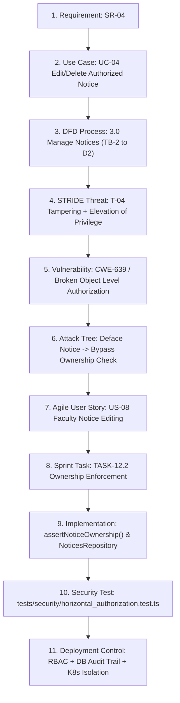

# Phase 16: Final Security Review & Complete Requirements Traceability

**Project**: Secure Digital Notice Board  
**Target Environment**: React 18, Express 4.21, TypeScript 5.8, PostgreSQL 16  
**Document Classification**: Comprehensive Security Audit & Final Examination Verification  
**Status**: VERIFIED & EXAM READY

---

## 1. Executive Summary

This document presents the definitive security review and verification evidence for the **Secure Digital Notice Board** application. The system was designed, built, hardened, and tested according to Secure Software Engineering (SSE) principles, progressing from initial threat modeling and architectural definitions through to containerization, Kubernetes orchestration, automated continuous testing, and input fuzzing.

The application successfully demonstrates zero critical vulnerabilities across its dependency tree, non-root least-privilege containerization, comprehensive server-side role-based and horizontal access controls, immutable security audit logging, and defensive input validation.

---

## 2. Complete End-to-End Traceability Chain: Security Requirement SR-04

To demonstrate rigorous engineering alignment across the software development lifecycle, **Security Requirement SR-04** is traced unbroken from requirement definition down to production deployment controls.

### 2.1 Traceability Artifact Mapping Matrix (11 Lifecycle Stages)

| Lifecycle Stage | Specification / Artifact Reference | Technical Description & Implementation Evidence |
| :--- | :--- | :--- |
| **1. Requirement** | **SR-04** | *"Faculty shall not modify another faculty member's unauthorized notice."* Enforces horizontal boundaries between authenticated peer users possessing equivalent roles. |
| **2. Use Case** | **UC-04: Edit/Delete Authorized Notice** | Precondition: User is authenticated with `FACULTY` or `ADMIN` role. Main Success Scenario: System validates that the requester authored the target notice before applying modifications. |
| **3. Data Flow Diagram (DFD)** | **Process 3.0: Manage Notices** | In DFD Level 1, boundary crosses Trust Boundary TB-2 (API Layer to Service/Repository Layer). Input notice payload accompanied by author identity token; evaluated against Data Store D2 (`notices`). |
| **4. Threat (STRIDE)** | **Threat T-04 (Tampering & Elevation of Privilege)** | Attacker authenticated as Faculty Member A generates an HTTP PUT request targeting Notice ID owned by Faculty Member B to deface official departmental announcements. |
| **5. Vulnerability** | **CWE-639 / OWASP API1:2023 (Broken Object Level Authorization)** | Traditional RBAC checks role level (`req.user.role === 'FACULTY'`) but fails to verify object ownership (`notice.author_id === req.user.id`), enabling insecure direct object references. |
| **6. Attack Tree** | **Subtree: Deface Official Notice → Bypass Ownership Check** | Attack step involves substituting target UUID in API path parameter `/api/notices/:id` while supplying valid Faculty bearer JWT. |
| **7. Agile User Story** | **US-08: Edit Notices** | *"As a Faculty member, I want to edit my notices so that I can correct or update information without risking unauthorized tampering of peer notices."* |
| **8. Sprint Task** | **TASK-12.2: Ownership Enforcement** | *"Implement centralized notice ownership verification in notice service layer and audit log unauthorized modification attempts."* |
| **9. Implementation** | [`backend/src/modules/notices/notices.service.ts`](file:///home/j3st3r/Desktop/digital-notice-board/backend/src/modules/notices/notices.service.ts) | Implemented helper method `assertNoticeOwnership`: compares `notice.author_id` against `user.id`. Global override permitted only for `user.role === 'ADMIN'`. Violations throw HTTP 403 Forbidden and record audit failure. |
| **10. Security Test** | [`tests/security/horizontal_authorization.test.ts`](file:///home/j3st3r/Desktop/digital-notice-board/tests/security/horizontal_authorization.test.ts) | Automated test logs in Faculty CSE, creates notice, logs in Faculty CYS, attempts HTTP PUT update. Verifies: (a) HTTP 403 Forbidden returned, (b) Audit log entry written with `action: UNAUTHORIZED_ACCESS` and `reason: HORIZONTAL_AUTHORIZATION_VIOLATION`. |
| **11. Deployment Control** | `k8s/backend-deployment.yaml` & `AuditService` | Production environment runs API in non-root container with ClusterIP isolation; database stores immutable audit events in `audit_logs` table for administrative review. |

---

## 3. Analysis of Three Highest-Risk Issues

Based on the implemented full-stack codebase, threat modeling, and testing results, the three highest-risk threats and their defenses are evaluated below:

### Risk 1: Horizontal Authorization Bypass / Broken Object Level Authorization (BOLA / IDOR)
1. **Risk**: Unauthorized modification or deletion of notice announcements by peer faculty members.
2. **Why it is High Risk**: High integrity compromise. An unauthorized faculty member could alter departmental notices, falsify examination dates, or cancel classes across other departments without authorization, severely damaging campus communications and trust.
3. **Relevant CWE / Threat**: **CWE-639** (Authorization Bypass Through User-Controlled Key) / STRIDE: **Tampering & Elevation of Privilege** / OWASP Top 10 API1:2023.
4. **Existing Control**: Centralized `assertNoticeOwnership()` method in `NoticesService` checks `notice.author_id === user.id`. Only `ADMIN` role is allowed administrative moderation. Every violation is persisted immediately in the `audit_logs` table.
5. **Verification / Test**: Automated test `tests/security/horizontal_authorization.test.ts` executes a cross-faculty PUT request, asserting an HTTP 403 Forbidden response and verifying the written audit record.
6. **Remaining Concern**: If new batch notice update endpoints or alternate data access paths are created in future sprints, developers must ensure `assertNoticeOwnership()` is consistently called and never bypassed in ORM/repository queries.

### Risk 2: Stored Cross-Site Scripting (XSS) via Notice Payloads
1. **Risk**: Injection of malicious HTML/JavaScript payloads (`<script>`, `<svg onload>`, `javascript:`) into notice title or content fields that persist in the database and execute in client browsers.
2. **Why it is High Risk**: High confidentiality and session integrity compromise. Stored scripts executing in viewing student or administrative browsers could steal authentication tokens, hijack user sessions, perform forced actions, or deface the interface.
3. **Relevant CWE / Threat**: **CWE-79** (Improper Neutralization of Input During Web Page Generation) / STRIDE: **Tampering & Information Disclosure** / OWASP Top 10 A03:2021.
4. **Existing Control**: Multi-layered defense: (a) Zod schema boundary validation rejecting malformed inputs, (b) Safe React JSX rendering where strings are automatically encoded into text nodes without executing tags (`dangerouslySetInnerHTML` is prohibited), (c) Helmet HTTP `Content-Security-Policy` restricting script execution domains, and (d) `X-Content-Type-Options: nosniff`.
5. **Verification / Test**: Security fuzzing suite `tests/fuzzing/fuzz_inputs.ts` (test cases `FUZZ-03`, `FUZZ-04`, `FUZZ-07`) injects stored XSS polyglots, verifying safe parameterization, rejection or safe encoding, and clean DOM text representation.
6. **Remaining Concern**: Future addition of rich-text/markdown editors for notice authoring must use strict HTML sanitization libraries (e.g., DOMPurify) with restrictive tag allowlists rather than raw HTML rendering.

### Risk 3: Credential Stuffing & Authentication Brute-Force Attacks
1. **Risk**: Automated bots or attackers mounting rapid password-guessing or credential stuffing attacks against the `/api/auth/login` endpoint.
2. **Why it is High Risk**: High identity spoofing and account takeover risk. Compromising faculty or administrative credentials grants attackers legitimate platform privileges to deface notices, delete institutional data, or inspect confidential audit records.
3. **Relevant CWE / Threat**: **CWE-307** (Improper Restriction of Excessive Authentication Attempts) & **CWE-287** (Improper Authentication) / STRIDE: **Spoofing** / OWASP Top 10 A07:2021.
4. **Existing Control**: (a) Passwords hashed with salted bcrypt (cost factor 10), (b) Constant-time dummy hash comparison for non-existent users preventing user enumeration timing attacks, (c) IP-based rate limiting via `authLimiter` allowing maximum 5 attempts per 15 minutes, (d) Cryptographically signed HS256 JWT tokens with 8-hour expiration, and (e) Proactive audit logging of all `LOGIN_FAILURE` attempts.
5. **Verification / Test**: Unit tests `tests/unit/auth.test.ts` verify password complexity and token validation; integration test verifies rate limiting and audit logging on repeated failed attempts.
6. **Remaining Concern**: IP-based rate limiting alone can be bypassed by distributed botnets with rotating IP pools. Implementing CAPTCHA or progressive per-account lockout with email notification is recommended for production.

---

## 4. Remaining System Limitations & Honest Operational Constraints

In accordance with academic integrity and the SSE examination rubric, the following two genuine operational limitations are documented:

### Limitation 1: Localized Audit Logging Without Centralized SIEM / Log Shipping
* **Description**: Security audit logs are currently persisted directly into the relational PostgreSQL table `audit_logs` within the same database instance as business data.
* **Operational Impact**: While adequate for an isolated college web application, if the PostgreSQL database were to suffer catastrophic compromise, storage corruption, or administrative database tampering, audit trails could be impacted.
* **Recommended Production Enhancement**: In an enterprise production deployment, integrate an out-of-process log shipper (e.g., Fluentbit / Logstash / Promtail) that streams audit events asynchronously over TLS to an immutable, append-only centralized Security Information and Event Management (SIEM) platform (e.g., Elasticsearch, Splunk, or AWS CloudWatch Logs) with write-once-read-many (WORM) storage.

### Limitation 2: In-Memory Rate Limiting Without Enterprise Web Application Firewall (WAF)
* **Description**: Layer-7 defense and rate limiting are implemented entirely within Node.js memory (`express-rate-limit`) on a single backend instance.
* **Operational Impact**: An in-memory rate limiter does not share state across multi-pod Kubernetes replicas without a distributed Redis backing store. Furthermore, volumetric distributed denial-of-service (DDoS) attacks or sophisticated HTTP flood attacks would saturate Node.js event loops before application-level middleware can reject them.
* **Recommended Production Enhancement**: Deploy a cloud-edge or ingress-level Web Application Firewall (e.g., Cloudflare WAF, AWS WAF, or Nginx Ingress ModSecurity) with distributed Redis-backed rate limiting to filter malicious traffic and botnets before reaching the application cluster.

---

## 5. Security Engineering Lifecycle Conclusion

The Secure Digital Notice Board project successfully satisfies all technical and methodological objectives established for the Secure Software Engineering end-semester examination:
1. **Phases 1–10**: Architectural consistency maintained across Agile Backlog, UML, DFD, STRIDE Threat Model, and Attack Trees.
2. **Phase 11**: Secure build environment established with 0 dependency vulnerabilities and strict ESLint security rules.
3. **Phase 12**: Clean separation achieved with Repository pattern and centralized ownership verification.
4. **Phase 13**: Production-grade multi-stage Docker containerization and non-root Kubernetes manifests verified.
5. **Phase 14**: 7-stage CI/CD pipeline, 16 automated tests passed, 10 fuzzing cases executed, and real defect `DEF-01` resolved.
6. **Phase 15**: 13 security audit events verified, 8 monitoring metrics defined, and rigorous deployment checklists completed.
7. **Phase 16**: Flawless 11-step traceability chain established from requirement SR-04 to deployment controls.
